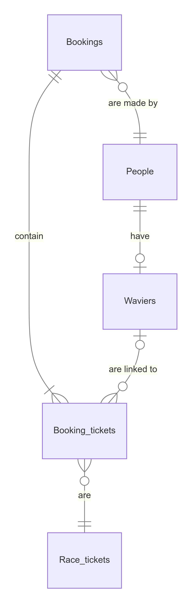

# Design Document

By Samuel Wycklendt

Video overview: <URL [HERE](https://www.youtube.com/watch?v=rdu9rCy73a4)>

## Scope

I created this database to handle and track the customers, waivers for customers, bookings, and tickets for a go-karting establishment near where I live. Included in this database's scope are:

* People: Customers for the business and their identifying information.
* Waivers: Every person who races needs to sign a waiver which expires after one year. Waivers track the customer, and the date the waivers expire.
* Race_Tickets: An entity representing all the variations of the business' primary product, go-kart racing.
* Bookings: All the information relevant to a booking, including the date, number of tickets, race time, and booking holder.
* Booking_tickets: A table which relates a ticket to a booking, and also relates a waiver to a particular ticket.

Outside of the scope of this database are any other products the establishment might sell like snacks or drinks. Also things like customer reviews or party bookings are not included in this database.

## Functional Requirements

This database will support:

* Adding bookings, customers, waivers, and tickets.
* Tracking all bookings, customers, and waivers.
* Linking multiple tickets to a booking and linking a customer waiver to a booking ticket.

This database currently does not check if a booking date is valid, or if a wavier attached to a ticket is expired.

## Representation

### Entities

#### People

The People table includes:

* "id", which is an integer primary key for each person in the database.
* "first_name", which stores the first name for a given customer. As such, it is a TEXT field that cannot be NULL.
* "last_name", which stores the last name for a given customer. Like first_name, it is a TEXT field that cannot be NULL.
* "age", which is an INTEGER that stores a customer's age. This field is optional.
* "email", which stores a customer's email as in a TEXT field. This field cannot be NULL as it is the main way a customer is identified.
* "phone_number", which stores a customer's phone number as a NUMERIC. This field is optional.

#### Waivers

Every customer who races must have a waiver filled out beforehand. The waivers table tracks all waivers and links them to a customer in the people table.

* "id", which is an integer primary key for each waiver in the database.
* "person_id", which is the INTEGER id of the person who signed the waiver, it cannot be NULL. Hence, this column is a FOREIGN KEY that references the id column in the people table. The ON DELETE condition is set to CASCADE.
* "signed_date", which is the date the waiver was signed, stored as a NUMERIC. It has a default value CURRENT_DATE so this column never needs to be set manually.
* "end__date", which stores the date the waiver expires as a NUMERIC. The default value is a date one year out from the signed_date.

#### Race_tickets

The race_tickets table tracks all the tickets of a race that the go-karting business has made available for purchase.

* "id", which is an integer primary key for each ticket in the database.
* "name", which is business' name for the ticket. This field is TEXT, cannot be NULL, and must be UNIQUE.
* "number_of_laps", which is the number of laps the ticket is sold for. This field is an INTEGER and is NOT NULL.
* "price", which is the price of a ticket in dollars, stored as a REAL that cannot be NULL.

#### Bookings

The bookings table tracks all the bookings for races that a customer might make.

* "id", which is an integer primary key for each booking in the database.
* "booking_holder_id", which stores the INTEGER id of the customer who placed the booking. As such, this column is a FOREIGN KEY that references the id column in the people table. The ON DELETE condition is SET NULL so in case a booking holder is changed the booking is not deleted.
* "tickets_booked", which is a INTEGER field that stores the number of tickets bought for the booking. This colummn also has a NOT NULL constraint.
* "race_time", which is the scheduled tiem of day that a booking's race will start. This field is a NUMERIC type that cannot be NULL.
* "booking_date", which tracks the date that the race is booked for as a NUMERIC that cannot be NULL.

#### Booking_tickets

The booking_tickets table tracks the specific tickets purchased in a booking, and links a waiver to each ticket.

* "booking_id", which is the INTEGER id of the booking the ticket was purchased for, and cannot be NULL. As such, this column is a FOREIGN KEY that references the id column in the bookings table. The ON DELETE condition is set to CASCADE. If a booking is deleted all tickets linked to the booking will also be deleted.
* "ticket_id", which is the INTEGER id of the ticket type purchased in the booking that cannot be NULL. Hence, this column is a FOREIGN KEY that references the id column in the race_tickets table. The ON DELETE condition is set to CASCADE. If a race_ticket is deleted all tickets of that type linked to a booking will also be deleted.
* "waiver_id", which is the INTEGER id of the waiver linked to a specific booking ticket. As such, this column is a FOREIGN KEY that references the id column in the waivers table. The ON DELETE condition is SET NULL so that a waiver linked to a ticket can be changed.

### Relationships

The below entity relationship diagram describes the relationships among the entities in the database.

In this diagram:

* A booking is made by one and only one person. Also, every booking contains at least one but possibly more booking_tickets.
* A person can make zero or more bookings, and a person will have zero or one waivers signed.
* A waiver is linked to one and only one person. At the same time, waiver can be linked to zero or more booking_tickets.
* A booking_ticket must be linked to one and only one booking. At the same time, a booking_ticket can be linked to one or zero waivers. Finally, every booking_ticket is one of the race_tickets that the business puts up for purchase.
* A race_ticket can be linked to ero or more booking_tickets.

## Optimizations

### Views

* Since the go-karting business wants to make sure that only non-expired waivers are valid the "active_waivers" view shows all waivers in the database that have not yet passed their end_date.

* The view "booking_info" shows the general information for a booking in a more reader friendly way than the bookings table. It shows the booking holder's last name instead of an INTEGER id.

* The view "booking_contents" shows all the details for the different types of tickets purchased in a particular booking. Linking this view with the "booking_info" view shows a complete overview of everything purchased in the booking.

* The view "booking_people" shows the names and ages of every person who has a waiver linked to a ticket for a particular booking. While this view does not show which people are linked to which ticket, it gives an overview of all the people linked to a booking.

### Indexes

* It is common for a customer to be looked up by their last name and/or email so "person_index" was made on those two columns in the people table.

* It is expected that waivers will be searched by their end_date (some of the views already do that) so "waiver_index" was created on that column in the waivers table.

* "ticket_index" was created on the name column of the race_tickets table to speed searches as the selection of tickets grows.

* It is expected that bookings will be primarily selected by data (maybe the current day) so "bookings_date_index" was created on the booking_date column in the bookings table.

* Another common selection for bookings would be by race_time so "booking_racetime_index" was created on the race_time column in the bookings table.

* As a relationship table, the booking_tickets table is used in many views, and is expected to be used in most queries. Hence, the "booking_ticket_index" was created on all three columns in the booking_tickets table.

## Limitations

In the current schema an expired waiver could be linked to a booking_ticket, and the same waiver could be linked to multiple tickets in the same booking.
